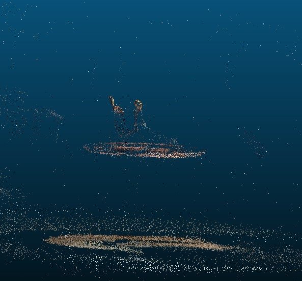

# Shoe Splatter

A project for building 3DGS models of shoes.

Performs automatic detection and segmentation of shoes using Grounded-SAM-2.
Removes points from SfM sparse point cloud that are not inside segmentation masks.
Trains a 3DGS model using Nerfstudio's Gsplat only in masked region.

## TODO

Although it was a fun experiment to bulid, it appears that this strategy to mask inputs doesn't make decent results. It is very likely that the segmentation masks will not be perfect, and if the images are lower resolution, it will be worse. This could lead to some of the SfM points remaining in unwanted areas (see images #2). The 3DGS optimization strategy attempts to densify these unwanted points and artifacts show up as training goes on (see images #3). 

I found the SAGA repo (https://github.com/Jumpat/SegAnyGAussians) that I might try to implement to segment gaussians rather than pixels.

## System Requirements

- Python 3.10
- Docker
- CUDA >= 12.1
- NVIDIA Container Toolkit
- Git LFS
- CUDA_ARCHITECTURES=86

## Setup Instructions

Follow these steps to set up the shoe-splatter repository and its dependencies:

1. Clone the repository:
```sh
git clone https://github.com/tsugg/shoe-splatter.git --recursive
cd shoe-splatter
git submodule update --init --recursive
git lfs fetch --all
```

2. Download model files:
   
For detailed instructions on downloading the required model files, please refer to the [MODEL_INSTALL.md](checkpoints/MODEL_INSTALL.md) file.

3. Build Docker images:

* Edit docker-compose.yml volumes 

```sh
docker compose build
docker compose up -d
```

## Usage

Follow these steps to run shoe splatter

1. Preprocess data:

* Edit $DATASET_NAME

```sh
export DATASET_NAME=images/blundstone/single/
docker exec -it splat python shoe_splatter/scripts/sfm.py --input /app/data/$DATASET_NAME --output /app/results/$DATASET_NAME
docker exec -it masks python shoe_splatter/scripts/detect_masks.py --input /app/results/$DATASET_NAME
docker exec -it splat python shoe_splatter/scripts/mask_pc.py --input /app/results/$DATASET_NAME
```

2. Train scene:

```sh
docker exec -it splat python shoe_splatter/scripts/shoe_splatter_train.py --input /app/results/$DATASET_NAME 
```

## Images

1. Shoe detection and segmentation:

<p align="center">
  
  
  
</p>


2. Pruning SfM sparse point cloud using segmentation mask:

<p align="center">
  
  
</p>


3. 3DGS optimization algorithm placing new gaussians in undesired places as training progresses:

<p align="center">
  
  
</p>
